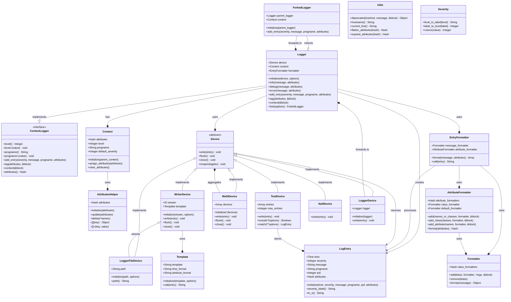
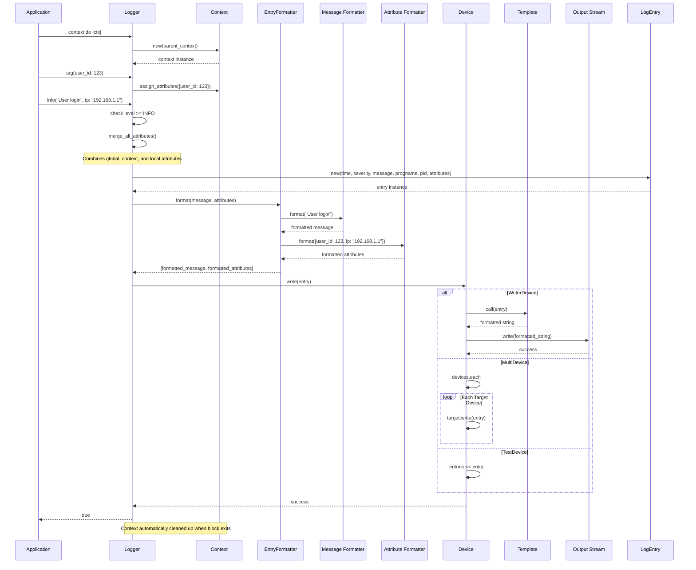

# Lumberjack Logging Framework Architecture

This document provides a comprehensive overview of the Lumberjack logging framework architecture, illustrating how the various components work together to provide a flexible, high-performance logging solution for Ruby applications.

## Overview

Lumberjack is a structured logging framework that extends Ruby's standard Logger with advanced features including:

- **Structured logging** with attributes (key-value pairs)
- **Context isolation** for scoping logging behavior
- **Flexible output devices** supporting files, streams, and custom destinations  
- **Customizable formatters** for messages and attributes
- **Thread and fiber safety** for concurrent applications
- **Hierarchical logger forking** for component isolation

## Core Architecture

The framework follows a layered architecture with clear separation of concerns:



## Component Responsibilities

### Core Logger Components

**Logger**
- Main entry point for logging operations
- Manages device, context, and formatting coordination
- Provides standard logging methods (info, debug, error, etc.)
- Handles context creation and attribute management

**ContextLogger**
- Mixin providing context-aware logging capabilities
- Manages level, progname, and attribute scoping
- Supports hierarchical contexts and attribute inheritance
- Thread and fiber-safe context isolation

**ForkedLogger**
- Creates isolated logger instances that forward to parent loggers
- Enables component-specific logging configuration
- Maintains independent context while sharing output infrastructure

### Context and Attribute Management

**Context**
- Stores scoped logging configuration (level, progname, attributes)
- Supports hierarchical inheritance from parent contexts
- Provides isolation for block-scoped logging behavior

**AttributesHelper**
- Manages attribute hash manipulation and access
- Supports dot notation for nested attribute access
- Handles attribute merging and deletion operations

### Entry Processing Pipeline

**LogEntry**
- Immutable data structure representing a single log event
- Contains all metadata: timestamp, severity, message, attributes
- Provides formatted string representation for output

**EntryFormatter**
- Coordinates message and attribute formatting
- Delegates to specialized formatters for different data types
- Handles complex formatting scenarios with embedded attributes

**Formatter & AttributeFormatter**
- Class-based and name-based formatting rules
- Recursive formatting for nested data structures
- Extensible formatting system with built-in formatters

### Device Architecture

**Device (Abstract Base)**
- Defines interface for log output destinations
- Supports lifecycle methods (flush, close, reopen)
- Enables pluggable output architecture

**WriterDevice**
- Writes formatted entries to IO streams
- Supports templated output formatting
- Handles encoding and error recovery

**MultiDevice**
- Broadcasts entries to multiple target devices
- Enables redundant logging and output splitting
- Maintains consistent state across all targets

**Specialized Devices**
- **LoggerFileDevice**: File-based logging with rotation
- **TestDevice**: In-memory capture for testing
- **NullDevice**: Silent operation for performance testing
- **LoggerDevice**: Forwards to other Logger instances

## Logging Flow Sequence

The following sequence diagram illustrates the complete flow of a log entry through the Lumberjack framework:



## Key Design Patterns

### 1. **Layered Architecture**
- Clear separation between logging interface, processing, and output
- Each layer has well-defined responsibilities and interfaces
- Enables independent testing and component replacement

### 2. **Strategy Pattern**
- Devices implement pluggable output strategies
- Formatters provide pluggable formatting strategies  
- Templates enable customizable output formatting

### 3. **Composite Pattern**
- MultiDevice composes multiple output devices
- AttributeFormatter composes class and attribute formatters
- Context inherits from parent contexts

### 4. **Chain of Responsibility**
- Formatting pipeline processes entries through multiple stages
- Context resolution follows inheritance chain
- Attribute merging follows precedence rules

### 5. **Facade Pattern**
- Logger provides simplified interface to complex subsystem
- ContextLogger abstracts context management complexity
- Utils module provides common functionality access

## Performance Characteristics

### **Memory Management**
- Immutable LogEntry objects prevent accidental modification
- Context inheritance minimizes memory duplication
- Attribute compaction removes empty values automatically

### **Thread Safety**
- Fiber-local storage for context isolation
- Mutex-protected device operations where needed
- Immutable data structures prevent race conditions

### **Lazy Evaluation**
- Block-based message generation for expensive operations
- Conditional formatting based on log levels
- On-demand context resolution

### **Efficient Routing**
- Level checking before entry creation
- Direct device writing without intermediate buffers
- Optimized formatter selection for common types

## Extension Points

The framework provides several extension points for customization:

### **Custom Devices**
```ruby
class DatabaseDevice < Lumberjack::Device
  def write(entry)
    database.insert_log(
      timestamp: entry.time,
      level: entry.severity_label,
      message: entry.message,
      attributes: entry.attributes
    )
  end
end
```

### **Custom Formatters**
```ruby
class JsonFormatter
  def call(obj)
    JSON.generate(obj)
  end
end

logger.formatter.add(Hash, JsonFormatter.new)
```

### **Custom Templates**
```ruby
json_template = ->(entry) do
  JSON.generate(
    timestamp: entry.time.iso8601,
    level: entry.severity_label,
    message: entry.message,
    attributes: entry.attributes
  )
end

device = Lumberjack::Device::Writer.new(STDOUT, template: json_template)
```

## Integration Patterns

### **Web Application Integration**
```ruby
# Rack middleware for request context
use Lumberjack::Rack::Context, {
  request_id: ->(env) { env["HTTP_X_REQUEST_ID"] },
  user_id: ->(env) { env["warden"]&.user&.id }
}
```

### **Component Isolation**
```ruby
# Component-specific loggers
class UserService
  def initialize(logger)
    @logger = logger.fork(progname: "UserService")
    @logger.tag!(component: "user_service", version: "1.2.3")
  end
end
```

### **Testing Integration**
```ruby
# Test environment setup
logger = Lumberjack::Logger.new(:test)
logger.info("Test message", user_id: 123)
expect(logger.device).to include(
  severity: :info,
  message: "Test message",
  attributes: {user_id: 123}
)
```

## Configuration Best Practices

### **Production Configuration**
```ruby
logger = Lumberjack::Logger.new("/var/log/app.log") do |config|
  config.level = :info
  config.shift_age = 10    # Keep 10 old files
  config.shift_size = 50.megabytes
  
  # Structured attribute formatting
  config.attribute_formatter.add("password") { |value| "[REDACTED]" }
  config.attribute_formatter.add(Time, :iso8601)
end
```

### **Development Configuration**
```ruby
logger = Lumberjack::Logger.new(STDOUT) do |config|
  config.level = :debug
  config.template = "[:time :severity] :message :attributes"
  
  # Pretty-print complex objects
  config.formatter.add(Hash, :pretty_print)
  config.formatter.add(Array, :pretty_print)
end
```

### **Multi-Environment Setup**
```ruby
file_device = Lumberjack::Device::LoggerFile.new("/var/log/app.log")
console_device = Lumberjack::Device::Writer.new(STDOUT)
error_device = Lumberjack::Device::Writer.new(STDERR)

multi_device = Lumberjack::Device::Multi.new(
  file_device,
  Rails.env.development? ? console_device : nil
).compact

logger = Lumberjack::Logger.new(multi_device)
```

This architecture enables Lumberjack to provide a powerful, flexible logging solution that scales from simple applications to complex, multi-component systems while maintaining excellent performance and developer experience.
