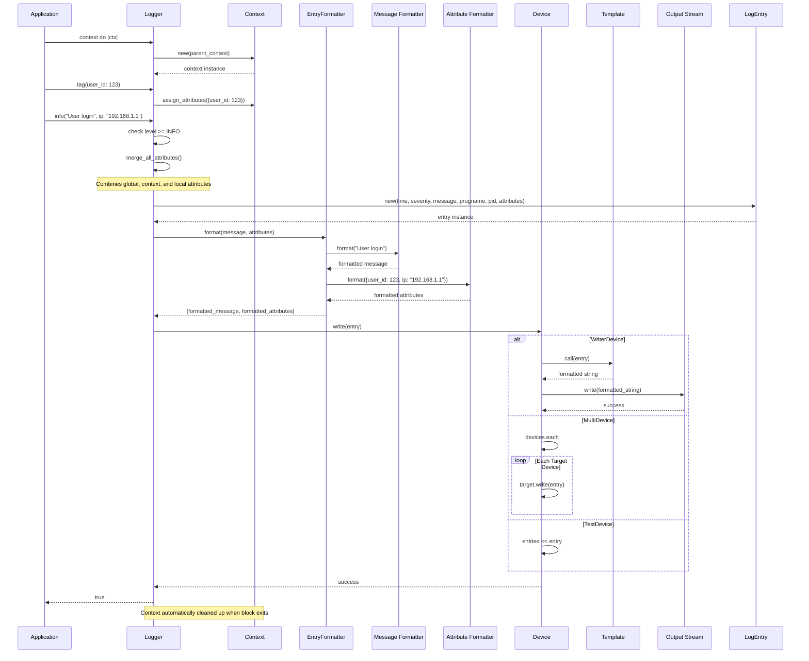

# Lumberjack Logging Framework Architecture

This document provides a comprehensive overview of the Lumberjack logging framework architecture, illustrating how the various components work together to provide a flexible, high-performance logging solution for Ruby applications.

## Overview

Lumberjack is a structured logging framework that extends Ruby's standard Logger with advanced features including:

- **Structured logging** with attributes (key-value pairs)
- **Context isolation** for scoping logging behavior
- **Flexible output devices** supporting files, streams, and custom destinations
- **Customizable formatters** for messages and attributes
- **Thread and fiber safety** for concurrent applications
- **Hierarchical logger forking** for component isolation

## Core Architecture

The framework follows a layered architecture with clear separation of concerns:

```mermaid
classDiagram
    %% Core Logger Classes
    class Logger {
        +Device device
        +Context context
        +EntryFormatter formatter
        +initialize(device, options)
        +info(message, attributes)
        +debug(message, attributes)
        +error(message, attributes)
        +add_entry(severity, message, progname, attributes)
        +tag(attributes, &block)
        +context(&block)
        +fork(options) ForkedLogger
    }

    class ContextLogger {
        <<interface>>
        +level() Integer
        +level=(value) void
        +progname() String
        +progname=(value) void
        +add_entry(severity, message, progname, attributes)
        +tag(attributes, &block)
        +context(&block)
        +attributes() Hash
    }

    class ForkedLogger {
        +Logger parent_logger
        +Context context
        +initialize(parent_logger)
        +add_entry(severity, message, progname, attributes)
    }

    %% Context and Attribute Management
    class Context {
        +Hash attributes
        +Integer level
        +String progname
        +Integer default_severity
        +initialize(parent_context)
        +assign_attributes(attributes)
        +clear_attributes()
    }

    class AttributesHelper {
        +Hash attributes
        +initialize(attributes)
        +update(attributes)
        +delete(*names)
        +[](key) Object
        +[]=(key, value)
    }

    %% Entry and Formatting
    class LogEntry {
        +Time time
        +Integer severity
        +String message
        +String progname
        +Integer pid
        +Hash attributes
        +initialize(time, severity, message, progname, pid, attributes)
        +severity_label() String
        +to_s() String
    }

    class EntryFormatter {
        +Formatter message_formatter
        +AttributeFormatter attribute_formatter
        +format(message, attributes) Array
        +format_class(classes, formatter, *args) self
        +format_message(classes, formatter, *args) self
        +format_attributes(classes, formatter, *args) self
        +format_attribute_name(names, formatter, *args) self
        +call(severity, timestamp, progname, msg) String
    }

    class Formatter {
        +Hash class_formatters
        +add(klass, formatter, *args, &block)
        +remove(klass)
        +format(message) Object
    }

    class AttributeFormatter {
        +Hash attribute_formatters
        +Formatter class_formatter
        +Formatter default_formatter
        +add(names_or_classes, formatter, *args, &block) self
        +add_class(classes, formatter, *args, &block) self
        +add_attribute(names, formatter, *args, &block) self
        +default(formatter, *args, &block) self
        +remove_class(classes) self
        +remove_attribute(names) self
        +format(attributes) Hash
        +include_class?(class_or_name) Boolean
    }

    %% Device Architecture
    class Device {
        <<abstract>>
        +write(entry) void
        +flush() void
        +close() void
        +reopen(logdev) void
        +datetime_format() String
        +datetime_format=(format) void
    }

    class DeviceWriter["Device::Writer"] {
        +IO stream
        +Template template
        +Buffer buffer
        +initialize(stream, options)
        +write(entry) void
        +flush() void
        +close() void
        +reopen(logdev) void
        +datetime_format() String
        +datetime_format=(format) void
    }

    class DeviceLogFile["Device::LogFile"] {
        +String path
        +initialize(path, options)
        +reopen(logdev) void
    }

    class DeviceDateRollingLogFile["Device::DateRollingLogFile"] {
        +String path
        +String frequency
        +initialize(path, options)
        +roll_file?() Boolean
    }

    class DeviceSizeRollingLogFile["Device::SizeRollingLogFile"] {
        +String path
        +Integer max_size
        +Integer keep
        +initialize(path, options)
        +roll_file?() Boolean
    }

    class DeviceMulti["Device::Multi"] {
        +Array devices
        +initialize(*devices)
        +write(entry) void
        +flush() void
        +close() void
        +reopen(logdev) void
        +datetime_format() String
        +datetime_format=(format) void
    }

    class DeviceTest["Device::Test"] {
        +Array entries
        +Integer max_entries
        +initialize(options)
        +write(entry) void
        +include?(options) Boolean
        +match(**options) LogEntry
        +clear() void
    }

    class DeviceNull["Device::Null"] {
        +initialize()
        +write(entry) void
    }

    class DeviceLoggerWrapper["Device::LoggerWrapper"] {
        +Logger logger
        +initialize(logger)
        +write(entry) void
    }

    class DeviceBuffer["Device::Buffer"] {
        +Array values
        +Integer size
        +initialize()
        +<<(string) void
        +empty?() Boolean
        +pop!() Array
        +clear() void
    }

    %% Template System
    class Template {
        +String template
        +String time_format
        +String attribute_format
        +initialize(template, options)
        +call(entry) String
    }

    %% Utility Classes
    class Utils {
        +deprecated(method, message, &block) Object
        +hostname() String
        +current_line() String
        +flatten_attributes(hash) Hash
        +expand_attributes(hash) Hash
        +global_pid() String
        +thread_name() String
        +global_thread_id() String
    }

    class Severity {
        +level_to_label(level) String
        +label_to_level(label) Integer
        +coerce(value) Integer
    }

    %% Relationships
    Logger --|> ContextLogger : implements
    ForkedLogger --|> Logger : inherits
    Logger --* Device : uses
    Logger --* Context : has
    Logger --* EntryFormatter : uses
    ForkedLogger --* Logger : forwards to

    Context --* AttributesHelper : uses
    EntryFormatter --* Formatter : uses
    EntryFormatter --* AttributeFormatter : uses
    AttributeFormatter --* Formatter : uses

    Device <|-- DeviceWriter : implements
    Device <|-- DeviceMulti : implements
    Device <|-- DeviceTest : implements
    Device <|-- DeviceNull : implements
    Device <|-- DeviceLoggerWrapper : implements
    DeviceWriter <|-- DeviceLogFile : inherits
    DeviceLogFile <|-- DeviceDateRollingLogFile : inherits
    DeviceLogFile <|-- DeviceSizeRollingLogFile : inherits

    DeviceWriter --* Template : uses
    DeviceWriter --* DeviceBuffer : uses
    Logger --> LogEntry : creates
    EntryFormatter --> LogEntry : processes
    Device --> LogEntry : receives

    DeviceMulti --* Device : aggregates
    DeviceLoggerWrapper --* Logger : forwards to
    DeviceTest --* LogEntry : stores
```

## Component Responsibilities

### Core Logger Components

**Logger**
- Main entry point for logging operations
- Manages device, context, and formatting coordination
- Provides standard logging methods (info, debug, error, etc.)
- Handles context creation and attribute management

**ContextLogger**
- Mixin providing context-aware logging capabilities
- Manages level, progname, and attribute scoping
- Supports hierarchical contexts and attribute inheritance
- Thread and fiber-safe context isolation

**ForkedLogger**
- Creates isolated logger instances that forward to parent loggers
- Enables component-specific logging configuration
- Maintains independent context while sharing output infrastructure

### Context and Attribute Management

**Context**
- Stores scoped logging configuration (level, progname, attributes)
- Supports hierarchical inheritance from parent contexts
- Provides isolation for block-scoped logging behavior

**AttributesHelper**
- Manages attribute hash manipulation and access
- Supports dot notation for nested attribute access
- Handles attribute merging and deletion operations

### Entry Processing Pipeline

**LogEntry**
- Immutable data structure representing a single log event
- Contains all metadata: timestamp, severity, message, attributes
- Provides formatted string representation for output

**EntryFormatter**
- Coordinates message and attribute formatting
- Delegates to specialized formatters for different data types
- Handles complex formatting scenarios with embedded attributes

**Formatter & AttributeFormatter**
- Class-based and name-based formatting rules
- Recursive formatting for nested data structures
- Extensible formatting system with built-in formatters

### Device Architecture

**Device (Abstract Base)**
- Defines interface for log output destinations
- Supports lifecycle methods (flush, close, reopen)
- Enables pluggable output architecture

**WriterDevice**
- Writes formatted entries to IO streams
- Supports templated output formatting
- Handles encoding and error recovery

**MultiDevice**
- Broadcasts entries to multiple target devices
- Enables redundant logging and output splitting
- Maintains consistent state across all targets

**Specialized Devices**
- **LogFileDevice**: File-based logging with rotation
- **TestDevice**: In-memory capture for testing
- **NullDevice**: Silent operation for performance testing
- **LoggerDevice**: Forwards to other Logger instances

## Logging Flow Sequence

The following sequence diagram illustrates the complete flow of a log entry through the Lumberjack framework:

